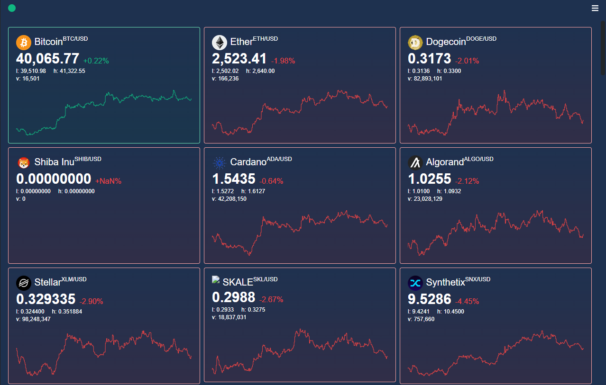
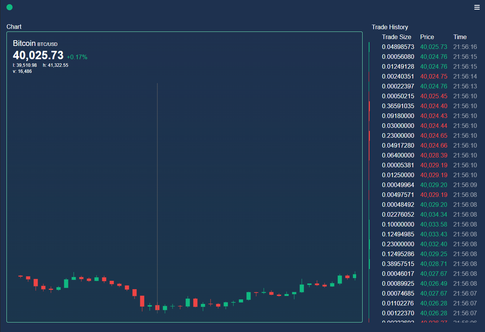

# Crypto Price Dashboard 📊

[](https://github.com/cluzier/crypto-price-dashboard/issues)
[](https://github.com/cluzier/crypto-price-dashboard/network)
[](https://github.com/cluzier/crypto-price-dashboard/stargazers)
[](https://github.com/cluzier/crypto-price-dashboard)
  

Shows current crypto prices and trade history


## Features

- Light/dark mode toggle (soon)
- Live price changes
- Toggle coins & reorganize them
- Cross platform
- Easily customizable

  
## Roadmap

- Add light/dark mode toggle
- Add a better charting system

  
## Screenshots

<div class="flex">


</div>
  
## Installation 

Install crypto-price-dashboard with npm

```bash 
  npm install
  npm run start
```
    
## Contributing

Contributions are always welcome!

See `contributing.md` for ways to get started.

Please adhere to this project's `code of conduct`.

  
## Authors

- [@cluzier](https://www.github.com/cluzier)

  
